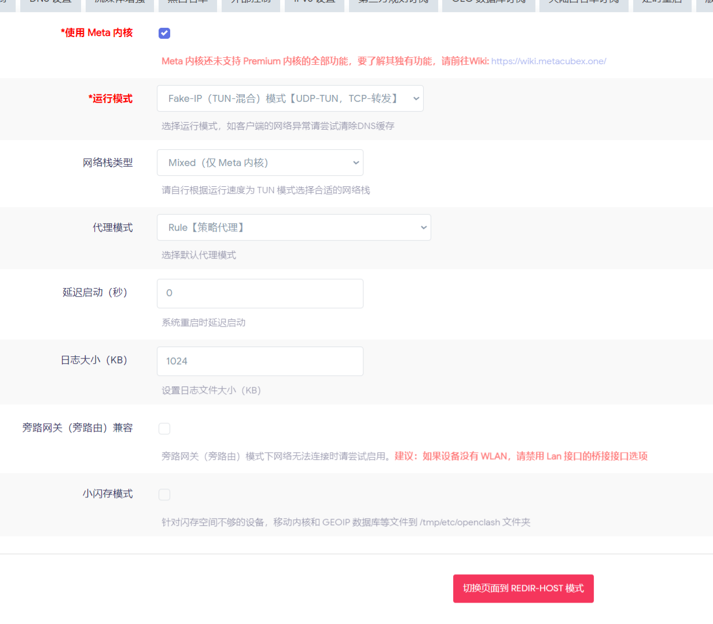

# 斐讯N1 iStoreOS配置

iStoreOS 是基于 OpenWrt 的第三方固件，在今年添加了对斐讯N1的支持。相比官方的 OpenWrt ，iStoreOS 的优点在于：

1. 对中文的支持更好，对国内用户更友好。
1. 官方维护了IStore商城，方便下载常用的OpenWrt软件。
1. 配置简单，有图形化界面，对新手更友好。

## 刷写

### 下载iStoreOS固件

在[iStoreOS官网](https://fw.koolcenter.com/iStoreOS/alpha/n1/)下载斐讯N1的固件。

### 刷写固件
使用 `Etcher` 或其他刷写工具将下载的固件刷写U盘中。

> 刷写问题可参照[iStoreOS官网](https://doc.linkease.com/zh/guide/istoreos/install_sd.html)的教程。

### 获取路由IP

有两种方式可以获取：

#### 方式一

1. **在U盘启动前** 将刷写U盘插到距离HDMI口最近的USB接口上
1. 盒子下电，HDMI连接显示屏
1. 盒子连接路由器 （n1 固件默认作为旁路由使用，IStoreOS会自动分配主路由网段下的任意IP）
1. 盒子上电，等待boot启动
1. 当命令行不在滚动时，按下回车键，出现 `ISTOREOS` 字样则启动成功
1. 使用 `ip addr` 命令获取路由IP


#### 方式二

1. 浏览器访问主路由IP，进入路由后台
1. 查看有线连接设备的IP地址 （名称为IStoreOS）

## 旁路由配置

上文已经查看到了IStoreOS的IP地址，接下来需要配置旁路由。

1. 浏览器访问IStoreOS的IP地址，进入路由后台
1. 输入默认密码登录之后找到 `网络向导`
1. 选择 `旁路由` 模式
1. 选择 `自动配置` 

1. 选择 `刷新`

1. 选择 `自动填写`
1. 关闭DHCP，保存配置


## 科学上网

科学上网采用OpenClash + MosDNS + AdGuardHome的方案。

- OpenClash：科学上网
- MosDNS：DNS解析 分流
- AdGuardHome：广告拦截 国外DNS解析

### 安装

首先在[Are-u-ok](https://github.com/AUK9527/Are-u-ok/blob/main/apps/README.md)下载我们需要的软件包。

下载完成后回到IStoreOS后台，找到IStore商店。选择手动安装，上传软件包进行离线安装。

### 配置

#### OpenClash

插件设置中 -> 模式选择:

- 勾选使用Meta内核
- 运行模式选择FakeIP （TUN + 混合）
- 网络栈选择Mixed



插件设置中 -> DNS：

- 本地DNS选择禁用


覆写设置 -> DNS：

- 勾选自定义上游服务器
- 添加FakeIP地址范围
- 勾选FakeIP持久化


覆写设置 -> Meta:

- 选择TCP并发
- 勾选域名探测


覆写设置 -> DNS服务器列表：


#### MosDNS


#### AdGuardHome

重定向选择无。界面设置如下：

上游服务器：

```
tls://1.1.1.1/dns-query
tls://dns.google
https://dns.google/dns-query
tls://dns11.quad9.net
https://dns11.quad9.net/dns-query
```


bootstrap:

```
9.9.9.10
8.8.8.8
```

私人反向：

```
127.0.0.1:5335
```


## 小结

配置完成后实现：

1. MosDNS接管DNSMaq，当访问国内域名直接使用腾讯云解析
1. Fallback时转发到OpenClash的DNS的Fallback策略组，从而进一步交给AdguardHome解析

可以有效解决域名污染问题。

后续可以进一步在AdGuardHome中配置广告拦截，从而实现全链路拦截。